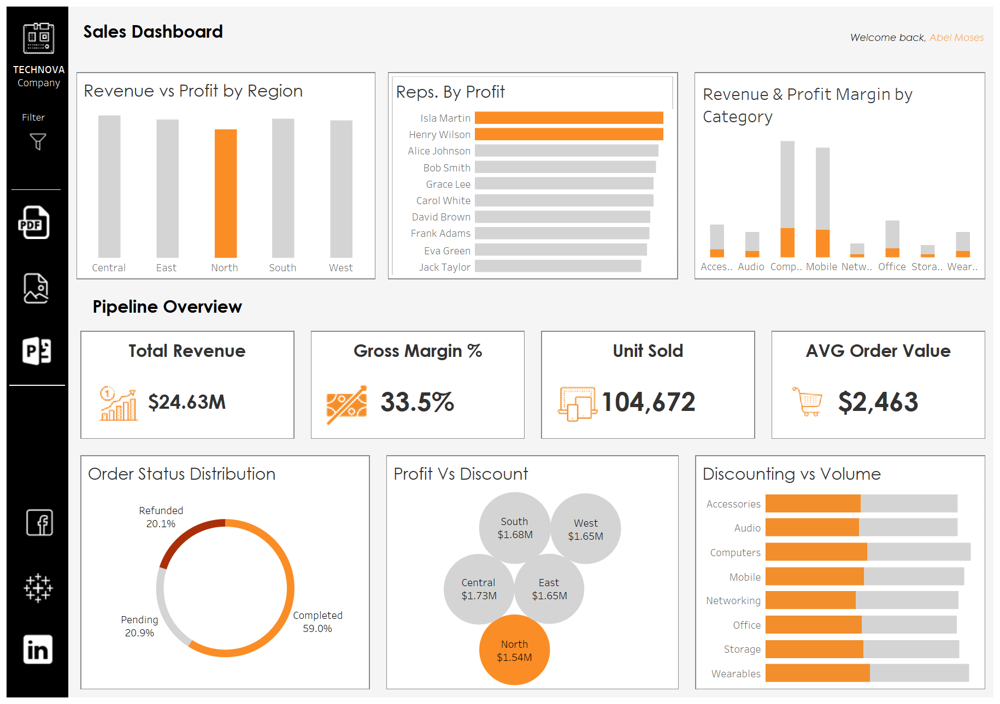
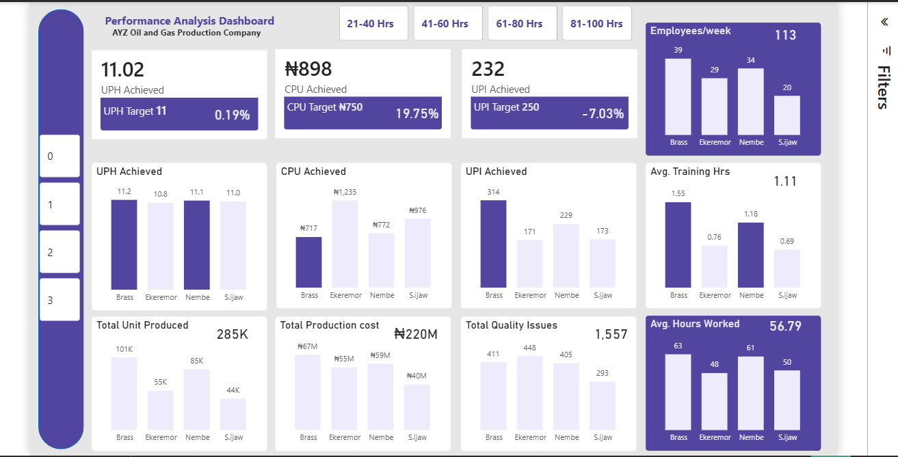
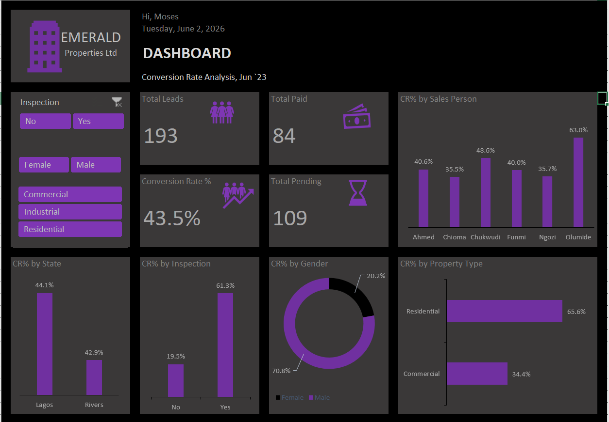
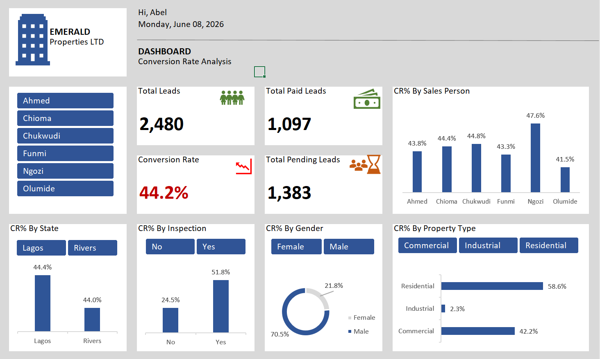
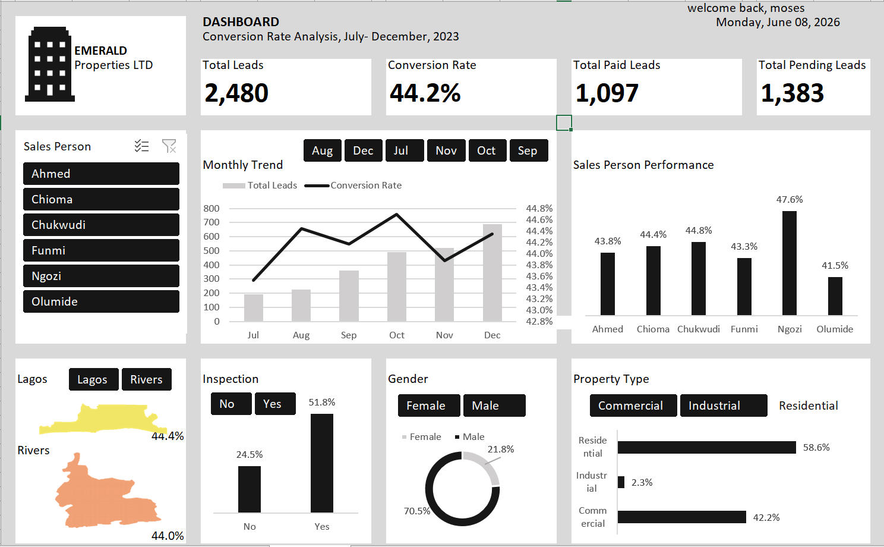
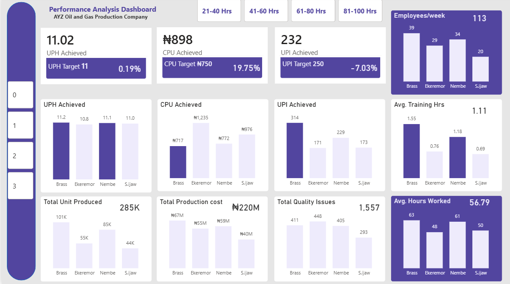
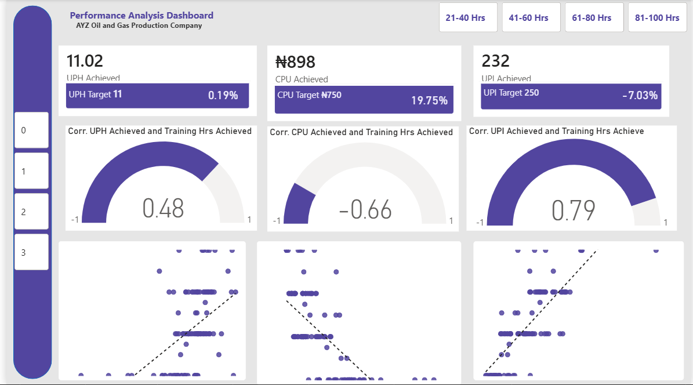
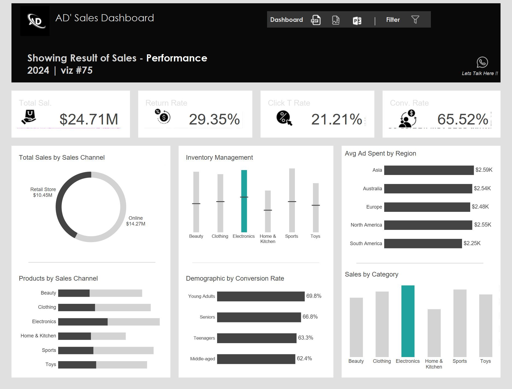

# Data_Analytics_Portfolio
## About
Hi, I'm Abel Moses Emelike - a data Analsyst and BI analyst with expereince in Power BI, Excel, MySQL, and Tableau. I enjoy transforming raw data into meaningful insights and building dashboards that drive smart decisions.

## Skills
Data Visualization -(Power BI, Excel, MySQL, And Tableau)
 

I build data visuals that help management make faster, more informend decisions. [click here](https://www.linkedin.com/in/moses-abel-1154803a6/recent-activity/all/)
Data interpretation & insight generation
Trend analysis & reporting 
Buisness problem-solving

## Project 1 (EXCEL)
AUTOMATED REAL ESTATE SALES DASHBOARD(Excel Project)
Developed an automated Excel dashboard to support sales and marketing teams with insights on total Leads, units sold, and remaining inventory. The dashboard also analyzed conversion rates, reasons for non-purchase, and gender-based interest, enabling better targeting and improving sales strategies while reducing manaul reporting.
 

## project 2 (POWER BI)
Build an automated power BI dashboard to track oil rig workforce performance, using correlation analysis to identify inefficiencies despite high work hours and enable targeted training, benchmarking, and improved operational efficiency

## Project 3 (Tableau)
I created a Sales and Marketing Dashboard in Tableau for two organizations to help management understand their business performance more clearly.
The dashboard used sales and pipeline charts to track customer journeys, sales trends, profits, and marketing results. It helped identify which products and services generated the most profit, where sales opportunities were being lost, and which marketing activities brought in the most customers.
By using the insights from the dashboard, both organizations were able to improve their sales strategies, make better marketing decisions, increase profitability, and support faster decision-making with real-time data.
 

## contact
+2347063595983
mosesabel3@yahoo.com
mosesabel3@gmail.com
